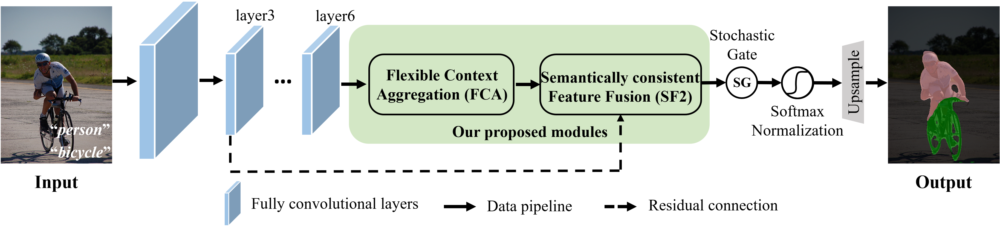
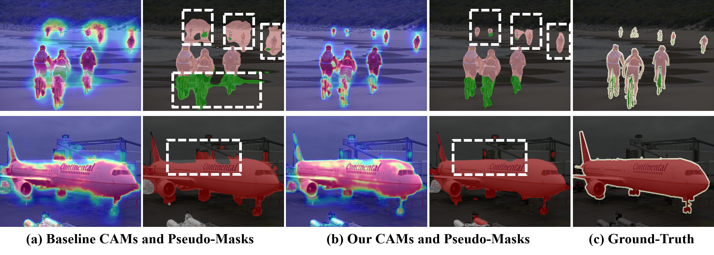

# Coupling Global Context and Local Contents for Weakly-Supervised Semantic Segmentation

This repository contains the official PyTorch implementation of the following paper:

#### Coupling Global Context and Local Contents for Weakly-Supervised Semantic Segmentation 

Chunyan Wang, Dong Zhang, Liyan Zhang and Jinhui Tang    
Computer Science and Engineering, Nanjing University of Science and Technology  
To appear at TNNLS 2023 as a regular paper

## Abstract 
<p align="justify">
Thanks to the advantages of the friendly annotations and the satisfactory performance, Weakly-Supervised Semantic Segmentation (WSSS) approaches have been extensively studied. Recently, the single-stage WSSS was awakened to alleviate problems of the expensive computational costs and the complicated training procedures in multi-stage WSSS. However, results of such an immature model suffer from problems of background incompleteness and object incompleteness. We empirically find that they are caused by the insufficiency of the global object context and the lack of the local regional contents, respectively. Under these observations, we propose a single-stage WSSS model with only the image-level class label supervisions, termed as Weakly-Supervised Feature Coupling Network (WS-FCN), which can capture the multi-scale context formed from the adjacent feature grids, and encode the fine-grained spatial information from the low-level features into the high-level ones. Specifically, a flexible context aggregation module is proposed to capture the global object context in different granular spaces. Besides, a semantically consistent feature fusion module is proposed in a bottom-up parameter-learnable fashion to aggregate the fine-grained local contents. Based on these two modules, WS-FCN lies in a self-supervised end-to-end training fashion. Extensive experimental results on the challenging PASCAL VOC 2012 and MS COCO 2014 demonstrate the effectiveness and efficiency of \textbf{WS-FCN}, which can achieve state-of-the-art results by 65.02% and 64.22% mIoU on PASCAL VOC 2012 val set and  test set, 34.12% mIoU on MS COCO 2014 val set, respectively.

## The overall architecture
<br> 

## Qualitative results
<br>

## Setup
1. **requirements.** This project was originally developed with Python 3.6, PyTorch 1.2 and CUDA 10.0.

2. **Download and link to the dataset.** We train our model on the original Pascal VOC 2012 augmented with the SBD data (10K images in total). Download the data from:
   - VOC: [Training/Validation (2GB .tar file)](http://host.robots.ox.ac.uk/pascal/VOC/voc2012/VOCtrainval_11-May-2012.tar)
    - SBD: [Training (1.4GB .tgz file)](http://www.eecs.berkeley.edu/Research/Projects/CS/vision/grouping/semantic_contours/benchmark.tgz)

    Link to the data:
    ```
    ln -s <your_path_to_voc> <project>/data/voc
    ln -s <your_path_to_sbd> <project>/data/sbd
    ```
    Make sure that the first directory in `data/voc` is `VOCdevkit`; the first directory in `data/sbd` is `benchmark_RELEASE`.
3. **Download pre-trained models.** Download the initial weights (pre-trained on ImageNet) for the backbones you are planning to use and place them into `<project>/models/weights/`.

    pretrained resnet38 weight: [ilsvrc-cls_rna-a1_cls1000_ep-0001.pth (402M)](https://download.visinf.tu-darmstadt.de/data/2020-cvpr-araslanov-1-stage-wseg/models/ilsvrc-cls_rna-a1_cls1000_ep-0001.pth) 


## Training, Inference and Evaluation
The directory `launch` contains template bash scripts for training, inference and evaluation. 

**Training.** For each run, you need to specify names of two variables, for example,EXP=baselines,RUN_ID=v01
```
python -u train.py  --dataset pascal_voc  --cfg configs/voc_resnet38.yaml  --exp baselines  --run v01
```
Running `bash ./launch/run_voc_resnet38.sh` will create a directory `./logs/pascal_voc/baselines/v01` with tensorboard events and will save snapshots into `./snapshots/pascal_voc/baselines/v01`.

**Inference.** To generate final masks, you will need to specify:
* `EXP` and `RUN_ID` you used for training;
* `OUTPUT_DIR` the path where to save the masks;
* `FILELIST` specifies the file to the data split;
* `SNAPSHOT` specifies the model suffix in the format `e000Xs0.000`. For example, `e018Xs0.905`;
* (optionally) `EXTRA_ARGS` specify additional arguments to the inference script.
```
python -u  infer_val.py  --dataset pascal_voc --cfg configs/voc_resnet38.yaml --exp baselines --run v01 --resume e018Xs0.905 --infer-list data/val_voc.txt  --mask-output-dir results/v01/
```

**Evaluation.** To compute IoU of the masks, you will need to specify `SAVE_DIR` that contains the masks and `FILELIST` specifying the split for evaluation.
```
python -u eval_seg.py --data /data/voc_aug --filelist data/val_voc.txt --mask results/v01/
```

## Weights
For testing, we provide our pre-trained WideResNet38 model:

| Backbone | Val | Val (+CRF) | weight link |
|:---:|:---:|:---:|---:|
| WideResNet38 | 61.57 | 63.23 | [model_enc_e018Xs0.905.pth (565M)](https://drive.google.com/file/d/1bNRef-QsR7QtOUYycHpplBSfg5UrIFG6/view?usp=sharing) |

we also release the masks predicted by this model:

| Split | IoU | IoU (+CRF) | weight link |
|:---:|:---:|:---:|:---:|
| val | 61.57 | 63.23 | [val_results.tar (6.94M)](https://drive.google.com/file/d/1Vy9thpf3vMkSv5iQeugJVMPe0vbDStAx/view?usp=sharing) | 
| test | 62.30 | 64.22 | [test_results.tar (6.71M)](https://drive.google.com/file/d/1TXNORaImcKqlX_Gbylg68UgaxxE7Oh-J/view?usp=sharing) |

## Acknowledgements
We thank PyTorch team, and Nikita Araslanov for releasing his [code](https://github.com/visinf/1-stage-wseg) that we hevily refered.
